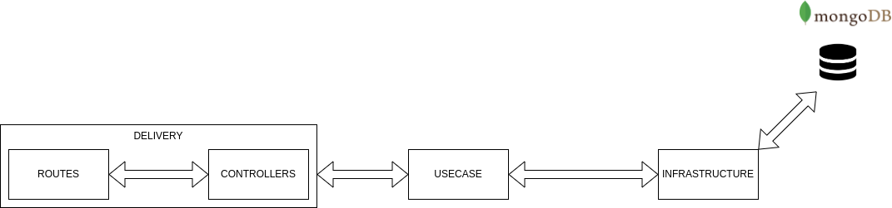

## Esse projeto tem por objetivo a criação de uma API para CRUDs de livros.

### Tecnologias:
- NodeJS
- MongoDB
- Docker
- Jest
- Typescript

BIG PICTURE



Para rodar o projeto em ambiente de desenvolvimento:

```npm run dev:server```

Para buildar o projeto:

```sudo docker-compose -f docker-compose.yml build```

```sudo docker-compose -f docker-compose.yml up```